<div align="center">


<br/>

[](https://git.io/typing-svg)

<br/>

[](https://www.linkedin.com/in/hirenghodasara)
&nbsp;
[](https://about.me/hiren.ghodasara)
&nbsp;
[](mailto:hiren.ghodasara@outlook.com)
&nbsp;
[](https://github.com/hiren-ghodasara)

</div>

<br/>

<div align="center">

I build **enterprise SaaS platforms**, **AI-powered agent workflows**, and **cloud-native systems** that scale.

</div>

<br/>

---

```typescript
const hiren = {
  title:      "Senior Full Stack Engineer",
  location:   "Greater Ahmedabad Area, India 🇮🇳",
  experience: "10+ years",
  focus: [
    "Scalable SaaS & Enterprise Platforms",
    "AI-Powered Agent Workflows",
    "Cloud-Native Architecture (AWS & GCP)",
    "Microsoft Office Add-ins (Microsoft Store)",
    "Multi-Tenant Systems at Scale",
  ],
  passion: "Turning complex problems into elegant, maintainable solutions",
  ask_me_about: ["system design", "cloud architecture", "AI integrations", "react", "node.js"],
};
```

> I enjoy taking **ownership end-to-end** — from architecture to deployment to long-term maintenance. Whether it's designing a new system, debugging a tricky issue, or finding a simpler way, I love the problem-solving side.

---

<div align="center">

</div>

---

## Featured Work

<table>
<tr>

<td width="50%" valign="top">

### 🔭 [opentelemetry-elastic-observability](https://github.com/hiren-ghodasara/opentelemetry-elastic-observability)

One `docker compose up` and you have a **full production-grade observability stack** — distributed tracing, metrics, and logs across a realistic Node.js microservice architecture, shipped straight into Elastic APM and Kibana.

Built this to solve the "where do I even start with OpenTelemetry?" problem.


[](https://github.com/hiren-ghodasara/opentelemetry-elastic-observability/stargazers)
[](https://github.com/hiren-ghodasara/opentelemetry-elastic-observability/forks)

</td>

<td width="50%" valign="top">

### 🤖 [claude-commit-preview](https://github.com/hiren-ghodasara/claude-commit-preview)

A **VS Code extension** that uses Claude to draft your git commit messages. Stage your changes, click the button — Claude reads the diff and writes a Conventional Commits–formatted message directly into the Source Control box, ready to edit and ship.

No more `fix stuff` commit messages.


[](https://github.com/hiren-ghodasara/claude-commit-preview/stargazers)
[](https://github.com/hiren-ghodasara/claude-commit-preview/forks)

</td>

</tr>
<tr>

<td width="50%" valign="top">

### 🧩 [react-drag-drop-grid](https://github.com/hiren-ghodasara/react-drag-and-drop-with-responsive-grid-layout-smooth-dnd-demo)

A **React demo** combining smooth-dnd drag-and-drop with a fully responsive grid layout. Cards snap into place, reorder naturally, and resize gracefully — the kind of UX detail that makes dashboards feel premium.

Good reference for any dashboard or Kanban-style UI.


[](https://github.com/hiren-ghodasara/react-drag-and-drop-with-responsive-grid-layout-smooth-dnd-demo/stargazers)
[](https://github.com/hiren-ghodasara/react-drag-and-drop-with-responsive-grid-layout-smooth-dnd-demo/forks)

</td>

<td width="50%" valign="top">

### 🗄️ [mongodb-export-import](https://github.com/hiren-ghodasara/mongodb-export-import)

A **shell utility** for syncing MongoDB databases between local and remote environments. Runs a safety backup before every operation so you never lose data mid-transfer. YAML-configured, SSH-ready, and straight to the point.

Because database migrations shouldn't require a runbook.


[](https://github.com/hiren-ghodasara/mongodb-export-import/stargazers)
[](https://github.com/hiren-ghodasara/mongodb-export-import/forks)

</td>

</tr>
</table>

---

<div align="center">

**Open to discussing** system design · cloud architecture · AI integrations · building great products

[](https://www.linkedin.com/in/hirenghodasara)

</div>
